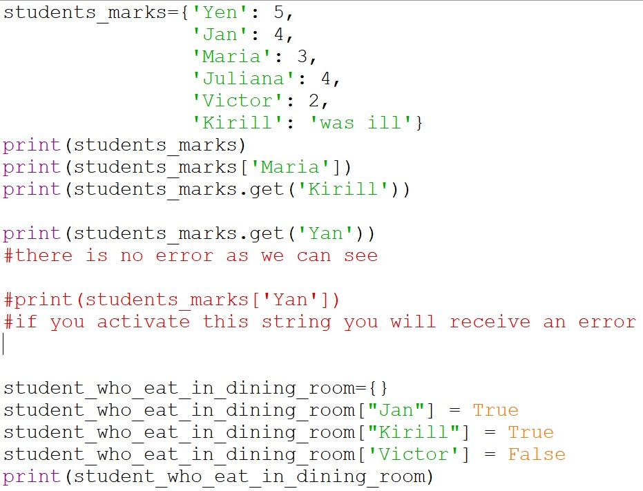

&nbsp;&nbsp;&nbsp;&nbsp;&nbsp;&nbsp;In this entry, we will talk about such a data type as a dictionary. What it is? A dictionary is a data structure in which information is stored in a key-value format. Here I will explain how to access the information stored in a dictionary and how to edit this information, talk about the main methods of dictionaries and how to use them.

&nbsp;&nbsp;&nbsp;&nbsp;&nbsp;&nbsp;Let's create 2 dictionaries, one stores information about students' grades, the other contains a list of students who eat in the canteen (Fig. 1.1). The dictionary is written in curly brackets. It can either contain initial data (<i>students_marks</i>) or be empty (<i>student_who_eat_in_dining_room</i>).

&nbsp;&nbsp;&nbsp;&nbsp;&nbsp;&nbsp;As mentioned earlier, all information in dictionaries is stored in the key-value format. If we need to get the value assigned to a particular key, we can do it directly or through the <i>get()</i> method. If the key we entered is missing, then the <i>get()</i> method will return <i>None</i>, but the call without it will give an error. This is important to consider when creating projects where it is not known for sure whether a key with the same name exists in the dictionary.

&nbsp;&nbsp;&nbsp;&nbsp;&nbsp;&nbsp;We can also add new keys and values, as well as change the values already in the dictionary. All the actions described above and their result can be seen in Fig. 1.1-1.2.

Figure. 1.1. Program listing 1

Figure. 1.2. Program output 1

&nbsp;&nbsp;&nbsp;&nbsp;&nbsp;&nbsp;Consider two other methods, namely <i>keys()</i> and <i>values()</i>. The first returns us all the keys in the dictionary, the second returns all the values, such as <i>dict_keys</i> and <i>dict_values</i> respectively. If we need to remove a pair from a dictionary, we can use <i>del</i> or <i>pop ()</i>. To display all key-value pairs, you need the <i>items()</i> method.

Figure. 2.1. Program listing 2

Figure. 2.2. Program output 2

* * *

To view these and other Python programs, you can visit <a href="https://github.com/Jexari/python_for_site" target = "_blank">my repository</a>.

