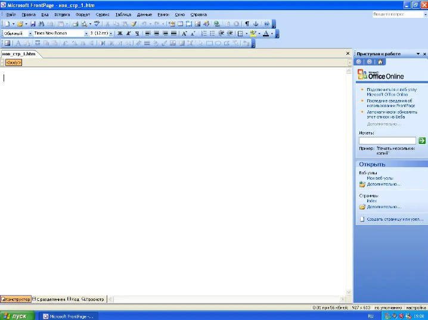

Content

<nav id="TableOfContents" class="nav flex-column">
<ul>
<li class="nav-item"><a href="#general_information" class="nav-link">1 General information</a></li>
<li class="nav-item"><a href="#installation_frontpage" class="nav-link">2 Installation Frontpage</a></li>
<li class="nav-item"><a href="#my_web_page" class="nav-link">3 My Web page </a></li>
<li class="nav-item"><a href="#outcome" class="nav-link">4 Conclusion </a></li>
</ul>
</nav>

<h2 id='general_information'><b>1. General information</b></h2>

Web pages can be created in several ways - from scratch or based on some kind of template. Both of these approaches can be implemented in Microsoft FrontPage. This editor was one of the best of its time, allowing you to edit HTML code, as well as view all changes in direct view mode. This editor did not require knowledge of the basics of HTML.

Main features of the editor:

<ul><li>create and save web pages</li>
<li>save web pages directly to the Web</li>
<li>view and administer web pages</li>
<li>create complex web page designs</li>
<li>use predefined HTML tags</li>
<li>use ready-made images from the software package, etc.</li></ul>

<h2 id='installation_frontpage'><b>2. Installation Frontpage</b></h2>

Installation of the program is simple, available when installing Office 2003.

Installation Microsoft FrontPage

Microsoft FrontPage in Start Menu

Interface FrontPage

<h2 id='my_web_page'><b>3. My Web page</b></h2>

I will not dwell on creating a web page in detail, since in fact we are working with the Microsoft Word interface. I will only show the final web page.

<h2 id='outcome'><b>4. Conclusion</b></h2>

Obviously, it is impossible to create a site with a modern design on a program for Windows XP, but despite this, some sites written in FrontPage still work. The Microsoft Frontpage was replaced by Microsoft Expression Web and Microsoft SharePoint Designer.

