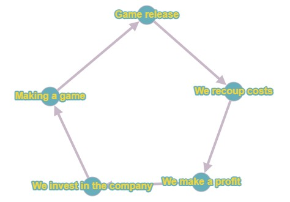
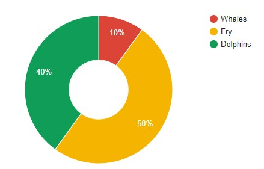
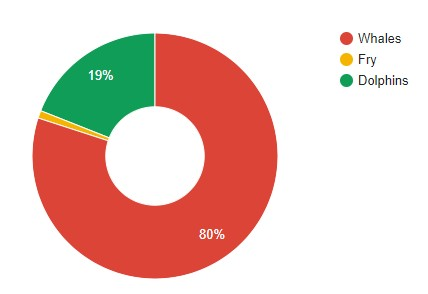

Content

<nav id="TableOfContents" class="nav flex-column">
<ul>
<li class="nav-item"><a href="#introduction" class="nav-link">1 Introduction</a></li>
<li class="nav-item"><a href="#methods_of_monetization" class="nav-link">2 Methods of monetization</a>
<ul>
<li class="nav-item"><a href="#inapp_purchases" class="nav-link">1 In-app purchases </a></li>
<li class="nav-item"><a href="#advertising" class="nav-link">2 Advertising</a></li>
<li class="nav-item"><a href="#subscription" class="nav-link">3 Subscription system</a></li>
<li class="nav-item"><a href="#preorder" class="nav-link">4 Pre-order and crowdfunding</a></li>
<li class="nav-item"><a href="#marketplaces" class="nav-link">5 Marketplaces </a></li>
<li class="nav-item"><a href="#premium_games" class="nav-link">6 Premium games </a></li>
</ul>
</li>
<li class="nav-item"><a href="#types_of_players" class="nav-link">3 Types of players</a>
<li class="nav-item"><a href="#social_proof" class="nav-link">4 Social proof </a>
<li class="nav-item"><a href="#choice_paralysis" class="nav-link">5 Choice paralysis </a>
<li class="nav-item"><a href="#conclusion" class="nav-link">6 Conclusion</a>
</ul>
</nav>

<h2 id='introduction'><b>1. Introduction</b></h2>

Game development has always been a rather time-consuming and expensive process. In our world, enthusiasm can infect a team only at the initial stage of the project (and even then not always), then financial injections into the project will be needed. Here we are faced with monetization. Monetization is a type of process that a video game publisher can use to generate revenue from a video game product. Its competent study will allow not only to recoup the invested funds, but also to profit from the project.

The pattern in the picture above is quite simple, you release a game, then pay for it and get some income that you invest in the company and prepare a new game. This is the cycle without which the work of any project is impossible.

<h2 id='methods_of_monetization'><b>2. Methods of monetization</b></h2>

Here we come to the issue of making money on video games. Mankind has come up with many ways to make money on the development of dopamine in players. One of the first can be considered a fee for arcade machines. Quite a lot of time has passed since then, gaming halls are a thing of the past and almost every home has its own computer or other device that can run games. The methods of monetization have also evolved, here are the main ones:

<ol>
<li>
In-app purchases

Usually, when using this type, the in-game store has additional products that the user buys at will.
</li>
<li>
Advertising

The most obvious form of monetization is in-game advertising. This is a great way to make money, but it's worth noting that users who pay money expect ad-free access. There are several main types of advertising content in games: banner ads (a static banner in part of the screen), full-screen ads (text-graphic ads that cover the background of the game), video ads, game ads (a mini-game in which you can perform primitive actions).
 

What to choose? It primarily depends on the type of game. For example, in shooters, it is better to forego full-screen ads and banner ads and choose video ads that will open between game sessions.
</li>
<li>
Subscription system

The user pays a certain amount once a month / year and gets access to the game for this period. Works well with trial access to the game. During this time, the user will feel the possibilities of the game.

Pros: profit is predictable and stable.

Cons: it is necessary to constantly maintain and update the content, to maintain its uniqueness.
</li>
<li>
Pre-order and crowdfunding

If developers make games for fun, then you can support them through voluntary donations. As a result, we get a product that has no ads, no micropayments.
</li>
<li>
Marketplaces

Typically, income comes as a percentage of sales of in-game items between users. Works great if the audience of the game is large and the game has a lot of things to exchange.
</li>
<li>
Premium games

Perhaps the oldest type of monetization, but still quite popular. The scheme is simple: the user pays money and receives the product. This type is most often used by large brands, as their name guarantees quality. Sooner or later, a successful paid game will be copied and released for a more affordable price.

Sometimes these games may also combine additional in-game purchases or payment for separate content that is not included in the price of the game itself.
</li>
</ol>

<h2 id='types_of_players'><b>3. Types of players</b></h2>

If the user can deposit money in the game, then it will be useful for us to get acquainted with the types of such payers. Traditionally, there are 3 types of players according to the size of donations: fry or minnows (pay small amounts), dolphins (pay more) and whales (pay huge amounts). In 2015, there was a <a href="https://www.gamesindustry.biz/its-all-about-the-players" target = "_blank">research</a> on this topic. It was revealed that half of all donators are fry, 40% are dolphins, and 10% are whales. And here we see that these 10% of whales provide 80% of all income. And that half of the fry at the exit gives 1% of the total profit. From this we can conclude that our task is to use our tools to make fry into dolphins, dolphins into whales, and keep the whales, because in fact it is the whales that generate income from the game.
 

Distribution of users by groups

Percentage of income from each group

<h2 id='social_proof'><b>4. Social proof</b></h2>

Social proof is one of the triggers in marketing that encourages the player to make purchases based on the opinions of others. One example of this technique can be called reviews about the game. It is more pleasant for the user to see when choosing a game not 4, but 5 stars. Or, for example, a notification about the purchase of in-game content by someone. It is not necessary that users know each other, they can be in the same clan or even just in the general chat of the game.

<h2 id='choice_paralysis'><b>5. Choice paralysis</b></h2>

Choice paralysis is the inability of a person to choose one offer from many. That is, if there are 25 products in the game store, then it will be more difficult for the user to choose something than when choosing from 5. Why is this happening? The point is that the player feels the risk of losing something. After all, he wants to choose the best at the moment. And in these conditions, many prefer to abandon the choice altogether. This should be taken into account when developing an in-game store.

<h2 id='conclusion'><b>6. Conclusion</b></h2>

Competent monetization can not only pay off the project, but also bring significant income to your company. It is important to carefully study the market before the final choice of how to make a profit.

