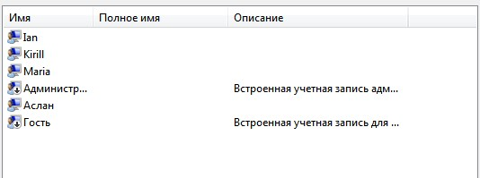
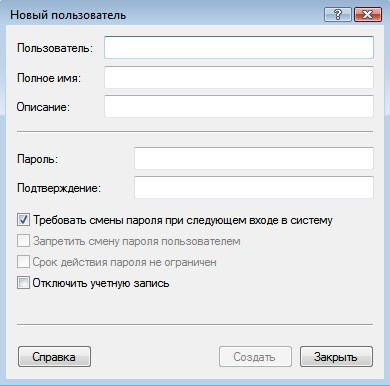
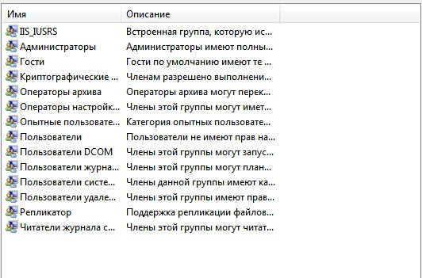
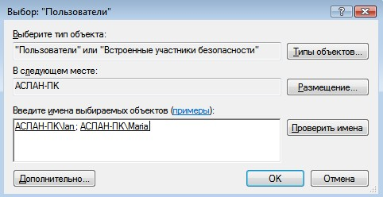
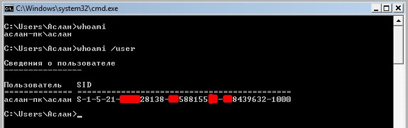

Content

<nav id="TableOfContents" class="nav flex-column">
<ul>
<li class="nav-item"><a href="#introduction" class="nav-link">1 Introduction</a></li>
<li class="nav-item"><a href="#Управление-учетными-записями-через-lusrmgrmsc" class="nav-link">2 Account management via lusrmgr.msc</a></li>
<li class="nav-item"><a href="#управление-учетными-записями-через-cmd" class="nav-link">3 Account management via cmd</a></li>
<li class="nav-item"><a href="#conclusion" class="nav-link">4 Conclusion</a></li>
</ul>
</nav>

<h2 id='introduction'><b>1. Introduction</b></h2>

&nbsp;&nbsp;&nbsp;&nbsp;&nbsp;&nbsp;An account is a set of data about a user that is necessary to authenticate him and provide access to his personal data and settings. Thus, an account consists of a username and password (or other means of authentication). The password is often encrypted or hashed. An account can store a user's photo or other image, take into account the age of various statistical characteristics of the user's behavior in the system.

&nbsp;&nbsp;&nbsp;&nbsp;&nbsp;&nbsp;It is not uncommon for several users to work on the same computer. On Linux, it is more convenient to manage users on the command line. In the Microsoft family of operating systems, this feature is also present, as is the GUI (Graphical User Interface).

&nbsp;&nbsp;&nbsp;&nbsp;&nbsp;&nbsp;Account management is one of the primary responsibilities of a system administrator. It is very convenient to combine users into groups, edit their access rights depending, for example, on their position in the company. This directly affects the security of the information system.

<h2 id='Управление-учетными-записями-через-lusrmgrmsc'><b>2. Account management via lusrmgr.msc</b></h2>

&nbsp;&nbsp;&nbsp;&nbsp;&nbsp;&nbsp;Immediately after installing Windows, we start working with Administrator rights. These rights in the OS allow, for example, to create, modify, delete other accounts, perform any operations to configure the system.

&nbsp;&nbsp;&nbsp;&nbsp;&nbsp;&nbsp;The lusrmgr.msc snap-in is used to manage accounts (Fig. 1). We can also open it by entering the name in the "Run" command field, or in the internal system search.

Figure. 1. lusrmgr.msc window

In order to create an account, you need to do the following:

<ol><li>Go to the "Users" folder (Fig. 2).</li>
<li>In the menu bar, select "Action", then "New User".</li>
<li>Be sure to fill in the "User" field, the rest if necessary (Fig. 3).</li></ol>

Figure. 2. OS users

Figure. 3. User creation

&nbsp;&nbsp;&nbsp;&nbsp;&nbsp;&nbsp;A user group is a collection of user accounts that have the same rights and security permissions. The user account must be a member of at least one user group.

&nbsp;&nbsp;&nbsp;&nbsp;&nbsp;&nbsp;Different users have different needs, the administrator can allocate the necessary permissions and prohibitions. If we have many users, then it is convenient to distribute rights not individually, but by user groups. Windows has several built-in groups: Administrators, Users, Power Users, Backup Operators, Guests, Remote Desktop Users, DHCP Administrators, DHCP Users, and WINS Users. We can also create our own group. For this:

<ol><li>Go to the "Groups" folder (Fig. 4).</li>
<li>In the menu bar, select "Action", then "Create Group".</li>
<li>Be sure to fill in the "Group Name" field, the rest if necessary (Fig. 5.1 - 5.2).</li></ol>

Figure. 4. List of all groups

Figure. 5.1. Create a group

Figure. 5.2. Adding users to a group

&nbsp;&nbsp;&nbsp;&nbsp;&nbsp;&nbsp;You can view which groups a user belongs to in the Users folder by right-clicking on the user, then selecting Properties, Group Memberships. If we go to the "General" tab, we can manage the user's password, and also, if necessary, disable the account (Fig. 6).

Figure. 6. Management in the "General" tab

&nbsp;&nbsp;&nbsp;&nbsp;&nbsp;&nbsp;The administrator can also set password time limits, for this you need to use the gpedit.msc snap-in. Next, go to "Computer Configuration", "Windows Configuration", "Security Settings", "Account Policy", "Password Policy" (Fig. 7).

Figure. 7. Changing the password expiration time

<h2 id='управление-учетными-записями-через-cmd'><b>3. Account management via cmd</b></h2>

&nbsp;&nbsp;&nbsp;&nbsp;&nbsp;&nbsp;As mentioned earlier, we can manage accounts through the command line. To begin with, we will write the command whoami and whoami /user (Fig. 8). The first displays information about the current user, the second additionally shows the SID (security identifier). SID is a variable length data structure that identifies a user, group, domain, or computer account. The last 4 digits indicate the object's relative security identifier (RID). 3 sets of numbers before RID is just the SID.

Figure. 8. whoami and whoami /user

For further account management, we need the net user command. With it, we can:

<ul><li>add an account (net user NAME PASSWORD /ADD) (Fig. 9.1);</li>
<li>add account password (net user NAME PASSWORD) (Fig. 9.4);</li>
<li>rename account (wmic useraccount where name='NAME' rename ‘NEWNAME’) (Fig. 9.2);</li>
<li>view account information (net user NAME) (Fig. 9.3);</li>
<li>change account password (net user NAME NEW_PASSWORD);</li>
<li>disable account (net user NAME /active:no);</li>
<li>delete your account (net user NAME /delete) (Fig. 9.5).</li></ul>

Figure. 9.1. Adding an account

Figure. 9.2. Adding an account

Figure. 9.3. Adding an account

Figure. 9.4. Adding a password to an account

Figure. 9.5. Deleting an account

To work with groups, you must use the net localgroup command. For example, with it we can:

<ul><li>list all local groups (net localgroup);</li>
<li>add local group (net localgroup GROUPNAME /add);</li>
<li>add existing user accounts to a group (net localgroup GROUPNAME USERNAME1 USERNAME2 /add /domain);</li>
<li>display a list of users in a local group (net localgroup GROUPNAME).</li></ul>

<h2 id='conclusion'><b>4. Conclusion</b></h2>

&nbsp;&nbsp;&nbsp;&nbsp;&nbsp;&nbsp;Thus, having become familiar with the basics of user management in the Windows operating system, we can draw the following conclusions:

&nbsp;&nbsp;&nbsp;&nbsp;&nbsp;&nbsp;Creating an account, changing the account password, and many other actions can be performed both through various snap-ins and through the command line. In the second case, we can use, for example, the net user command. Also with group changes, they can also be done in the two ways described above.

&nbsp;&nbsp;&nbsp;&nbsp;&nbsp;&nbsp;To ensure information security, it is necessary to sort their accounts into groups, where you can enter restrictions on their rights (for example, viewing certain folders).

