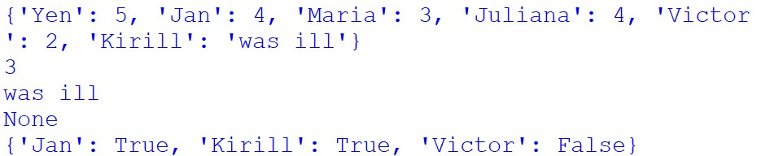
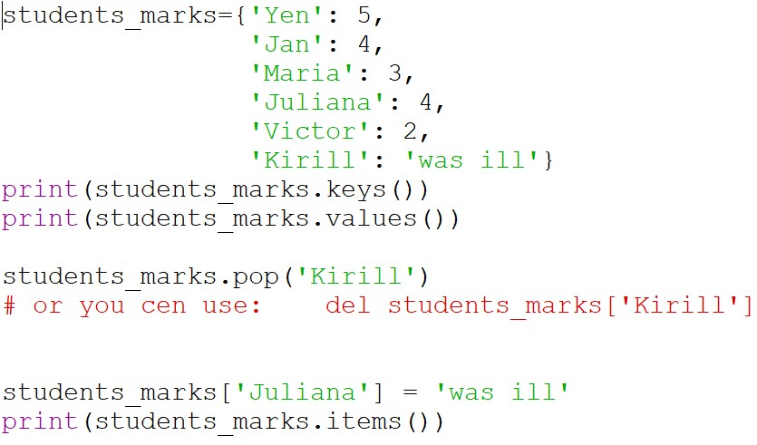

В этой записи речь пойдет о таком типе данных, как словарь. Что это такое? Словарь - это структура данных, в которой информация храниться в виде «ключ — значение». Здесь я расскажу, как получить доступ к информации, хранящейся в словаре, и как редактировать эту информацию, расскажу об основных методах словарей и как их использовать.

Создадим 2 словаря, в одном хранится информация об оценках учеников, в другом список учащихся, кто ест в столовой (рис.1.1). Словарь прописывается в фигурных скобках. Он может как содержать изначальные данные (<i>students_marks</i>), так и быть пустым (<i>student_who_eat_in_dining_room</i>).

Как говорилось ранее, вся информация в словарях хранится в формате «ключ — значение». Если нам необходимо получить значение присвоенное определенному ключу, то мы можем сделать это напрямую или через метод <i>get()</i>. В случае, если ключ введенный нами отсутствует, то метод <i>get()</i> вернет нам <i>None</i>, а вот обращение без него выдаст ошибку. Это важно учитывать при создании проектов, где точно не известно, есть ли ключ с таким именем в словаре.

Мы также можем добавлять новые ключи и значения, а также изменять значения уже имеющиеся в словаре. Все действия, описанные выше, и их результат можно увидеть на рис. 1.1-1.2. 

Рис. 1.1. Листинг программы 1

Рис. 1.2. Вывод программы 1

Рассмотрим два других метода, а именно <i>keys()</i> и <i>values()</i>. Первый возвращает нам все ключи в словаре, второй все значения, типа <i>dict_keys</i> и <i>dict_values</i> соответственно. Если нам необходимо удалить пару из словаря возпользуемся <i>del</i> или <i>pop ()</i>. Для вывода всех пар «ключ — значение» нужен метод <i>items()</i>.

Рис. 2.1. Листинг программы 2

Рис. 2.2. Вывод программы 2

* * *

Для просмотра этих и иных программ на языке Python вы можете посетить <a href="https://github.com/Jexari/python_for_site" target = "_blank">мой репозиторий</a>.

