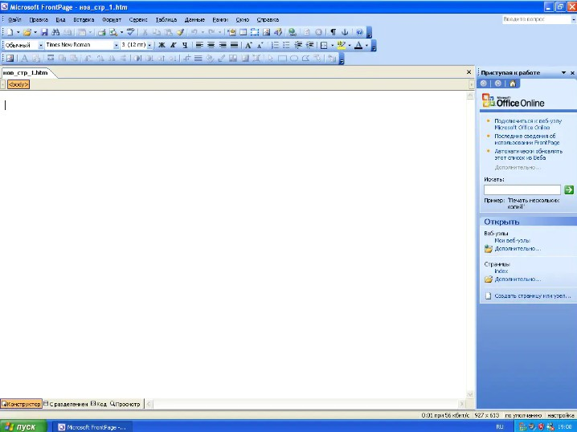
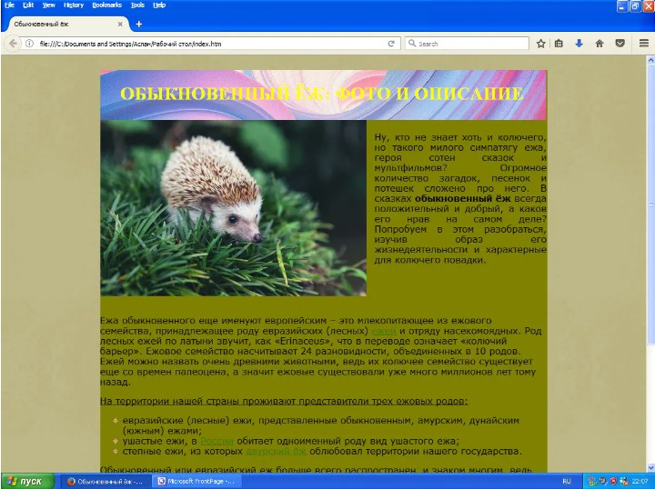

Содержание

<nav id="TableOfContents" class="nav flex-column">
<ul>
<li class="nav-item"><a href="#general_information" class="nav-link">1 Общая информация</a></li>
<li class="nav-item"><a href="#installation_frontpage" class="nav-link">2 Установка Frontpage</a></li>
<li class="nav-item"><a href="#my_web_page" class="nav-link">3 Моя Web-страница </a></li>
<li class="nav-item"><a href="#outcome" class="nav-link">4 Вывод </a></li>
</ul>
</nav>

<h2 id='general_information'><b>1. Общая информация</b></h2>

Web-страницы можно создавать несколькими способами - с нуля или на основе какого-то шаблона. Оба эти подхода можно реализовать в Microsoft FrontPage. Данный редактор был одним из лучших в свое время, позволял редактировать код HTML, а также просматривать все изменения в режиме непосредственного просмотра. Данный редактор не требовал знаний основ HTML.

Основные возможности редактора:

<ul><li>создавать и сохранять web-страницы</li>
<li>сохранять web-страницы непосредственно в Web</li>
<li>просматривать и администрировать web-страницы</li>
<li>создавать сложный дизайн web-страниц</li>
<li>использовать готовые теги HTML</li>
<li>
использовать готовые изображения из комплекта поставки программы и др.
</li></ul>

<h2 id='installation_frontpage'><b>2. Установка Frontpage</b></h2>

Установка программы несложная, доступна при установке Office 2003.

Установка Microsoft FrontPage

Microsoft FrontPage в меню пуск

Интерфейс FrontPage

<h2 id='my_web_page'><b>3. Моя Web-страница</b></h2>

Останавливаться подробно на создании web-страницы я не буду, так как по сути мы работаем с интерфейсом Microsoft Word. Покажу только итоговую web-страницу.

Web-страница

<h2 id='outcome'><b>4. Вывод</b></h2>

Очевидно, что создавать сайт с современным дизайном на программе для Windows XP - невозможно, но несмотря на это некоторые сайты, написанные на FrontPage, работают и сейчас. Заменой Microsoft Frontpage стали Microsoft Expression Web и Microsoft SharePoint Designer.

