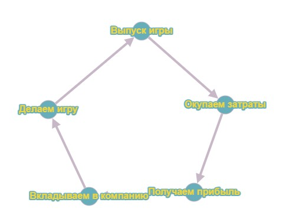
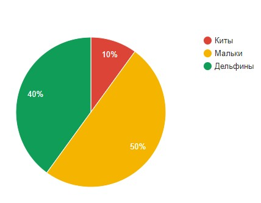
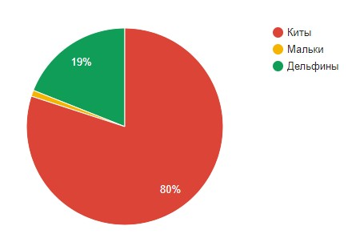

Содержание

<nav id="TableOfContents" class="nav flex-column">
<ul>
<li class="nav-item"><a href="#introduction" class="nav-link">1 Введение</a></li>
<li class="nav-item"><a href="#methods_of_monetization" class="nav-link">2 Способы монетизации</a>
<ul>
<li class="nav-item"><a href="#inapp_purchases" class="nav-link">1 Внутриигровые покупки </a></li>
<li class="nav-item"><a href="#advertising" class="nav-link">2 Реклама </a></li>
<li class="nav-item"><a href="#subscription" class="nav-link">3 Система подписки </a></li>
<li class="nav-item"><a href="#preorder" class="nav-link">4 Предзаказ и краудфандинг </a></li>
<li class="nav-item"><a href="#marketplaces" class="nav-link">5 Торговые площадки </a></li>
<li class="nav-item"><a href="#premium_games" class="nav-link">6 Premium игры </a></li>
</ul>
</li>
<li class="nav-item"><a href="#types_of_players" class="nav-link">3 Виды игроков </a>
<li class="nav-item"><a href="#social_proof" class="nav-link">4 Социальное доказательство </a>
<li class="nav-item"><a href="#choice_paralysis" class="nav-link">5 Паралич выбора </a>
<li class="nav-item"><a href="#conclusion" class="nav-link">6 Вывод </a>
</ul>
</nav>

<h2 id='introduction'><b>1. Введение</b></h2>

Разработка игр всегда была довольно трудоёмким и дорогим процессом. В нашем мире энтузиазмом можно заразить команду лишь на начальном этапе проекта (и то не всегда), затем нужны будут финансовые вливания в проект. Тут мы и сталкиваемся с монетизацией. Монетизация — это тип процесса, который издатель видеоигр может использовать для получения дохода от продукта видеоигр. Её грамотная проработка позволит не только окупить вложенные средства, но и получить прибыль от проекта.

Закономерность на картинке выше довольно проста, вы выпускаете игру, затем окупаете её и получаете некий доход, который вкладываете в компанию и готовите новую игру. Это цикл, без которого невозможна работа любого проекта.

<h2 id='methods_of_monetization'><b>2. Способы монетизации</b></h2>

Тут мы и подходим к вопросу заработка на видеоиграх. Способов заработать на выработке у игроков дофамина человечество придумало много. Одним из первых можно считать плату за аркадные автоматы. С тех пор прошло достаточно много времени, игровые залы ушли в прошлое и практически у каждого дома появился свой собственный компьютер или иное устройство, способное запускать игры. Эволюционировали также и способы монетизации, вот основные из них:

<ol>
<li>
Внутриигровые покупки

Обычно при использовании этого типа во внутриигровом магазине есть дополнительные продукты, которые пользователь покупает по желанию.
</li>
<li>
Реклама

Самый очевидный вид монетизации – реклама внутри игры. Это отличный способ заработка, но стоит отметить, что пользователи, заплатившие деньги, рассчитывают на доступ без рекламы. Выделяют несколько основных типов рекламного контента в играх: баннерная реклама (статический баннер в части экрана), полноэкранная реклама (текстово-графические объявления, закрывающее фон игры), видеореклама, игровая (мини-игра, в которой можно выполнить примитивные действия).
 

Что выбрать? Это в первую очередь зависит от типа игры. Например, в шутерах лучше отказаться от полноэкранной рекламы и баннерной рекламы и выбрать видеорекламу, которая будет открываться между игровыми сессиями.
</li>
<li>
Система подписки

Пользователь платит определенную сумму раз в месяц/год и получает доступ к игре на этот период. Хорошо работает при пробном доступе к игре. За это время пользователь ощутит возможности игры.

Плюсы: прибыль прогнозируема и стабильна.

Минусы: необходимо постоянно поддерживать и обновлять контент, сохранять его уникальность.
</li>
<li>
Предзаказ и краудфандинг

Если же разработчики делают игры для удовольствия, то поддержать их можно через добровольные пожертвования. В результате мы получаем продукт, в котором нет рекламы, нет микроплатежей.
</li>
<li>
Торговые площадки

Обычно доход идет в виде процента от продаж внутриигровых вещей между пользователями. Отлично работает, если аудитория игры большая и в игре присутствует множество вещей для обмена.
</li>
<li>
Premium игры

Пожалуй, самый старый тип монетизации, но всё равно довольно популярный. Схема проста: пользователь платит деньги и получает продукт. Используют такой тип чаще всего крупные бренды, так как их имя гарантирует качество. Рано или поздно успешная платная игра будет скопирована и выложена за более демократичную цену.

Иногда такие игры также могут совмещать и дополнительные внутриигровые покупки или оплату отдельного контента, который не входит в стоимость самой игры.
</li>
</ol>

<h2 id='types_of_players'><b>3. Виды игроков</b></h2>

Если же в игре пользователь может внести деньги, то нам будет полезно ознакомиться с видами таких плательщиков. Традиционно выделяют 3 типа игроков по размерам донатов: мальки или пескари (платят небольшие суммы), дельфины (платят побольше) и киты (платят огромные суммы). В 2015 году проводилось <a href="https://www.gamesindustry.biz/its-all-about-the-players" target = "_blank">исследование</a> на эту тему. Было выявлено, что половина всех донатеров – мальки, 40% - дельфины, а 10% - киты. И тут мы видим, что эти 10% китов дают 80% всего дохода. А та половина мальков на выходе даёт 1% от общей прибыли. Отсюда можно сделать вывод, что наша задача, использовать наш инструментарий, чтобы мальков сделать дельфинами, дельфинов китами, а китов удерживать, ведь по сути именно киты дают доход от игры.
 

Распределение пользователей по группам

Процент дохода от каждой группы

<h2 id='social_proof'><b>4. Социальное доказательство</b></h2>

Социальное доказательство – это один из триггеров в маркетинге, который побуждает игрока совершать покупки, опираясь на чужое мнение. Одним из примеров такого приёма можно назвать отзывы об игре. Пользователю приятнее видеть при выборе игры не 4, а 5 звезд. Или, например, оповещение о покупке кем-то внутриигрового контента. Необязательно, чтобы пользователи знали друг друга, они могут быть в одном клане или вообще просто в общем чате игры.

<h2 id='choice_paralysis'><b>5. Паралич выбора</b></h2>

Паралич выбора – неспособность человека выбрать одно предложение из множества. То есть, если в игровом магазине будет 25 товаров, то пользователю будет выбрать что-то сложнее, чем при выборе из 5. Почему так происходит? Дело в том, что игрок чувствует риск потерять что-то. Ведь ему хочется выбрать лучшее на данный момент. И в данных условиях многие предпочитают вообще отказаться от выбора. Это стоит учитывать при разработке внутриигрового магазина.

<h2 id='conclusion'><b>6. Вывод</b></h2>

Грамотная монетизация способна не только окупить проект, но и принести существенный доход вашей компании. Важно внимательно изучить рынок перед окончательным выбором способа получения прибыли.

