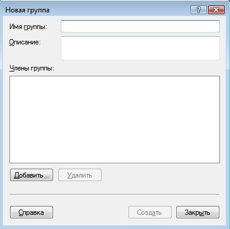
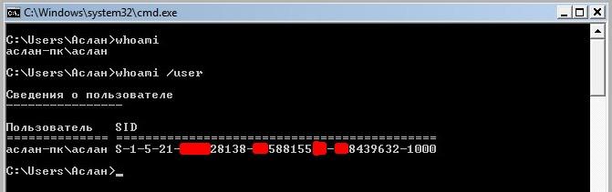
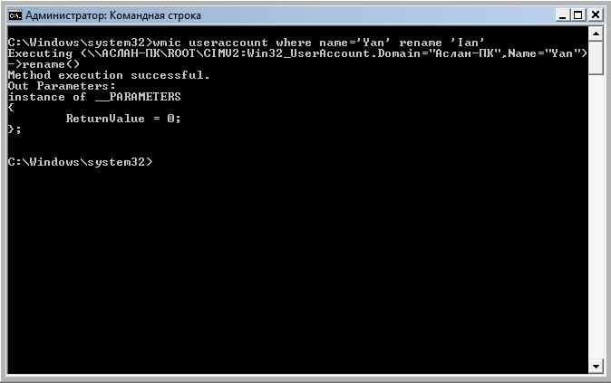

Содержание

<nav id="TableOfContents" class="nav flex-column">
<ul>
<li class="nav-item"><a href="#introduction" class="nav-link">1 Введение</a></li>
<li class="nav-item"><a href="#Управление-учетными-записями-через-lusrmgrmsc" class="nav-link">2 Управление учетными записями через lusrmgr.msc</a></li>
<li class="nav-item"><a href="#управление-учетными-записями-через-cmd" class="nav-link">3 Управление учетными записями через cmd</a></li>
<li class="nav-item"><a href="#conclusion" class="nav-link">4 Заключение</a></li>
</ul>
</nav>

<h2 id='introduction'><b>1. Введение</b></h2>

&nbsp;&nbsp;&nbsp;&nbsp;&nbsp;&nbsp;Учетная запись – это совокупность данных о пользователе, необходимая для его аутентификации и предоставления доступа к его личным данным и настройкам. Таким образом, учетная запись состоит из имени пользователя и пароля (либо иных способов аутентификации). Пароль зачастую зашифрован или хэширован. Учетная запись может хранить фотографию пользователя или иное изображение, учитывать давность различные статистические характеристики поведенияпользователя в системе.

&nbsp;&nbsp;&nbsp;&nbsp;&nbsp;&nbsp;Не редко за одним компьютером работают несколько пользователей. В Linux управление пользователями удобнее производить в командной строке. В группе семейств операционных систем Microsoft такая возможность так же присутствует, как и GUI (Graphical User Interface).

&nbsp;&nbsp;&nbsp;&nbsp;&nbsp;&nbsp;Управление учетными пользователями является одной из основных обязанностей системного администратора. Очень удобно объединять пользователей в группы, редактировать их права доступа в зависимости, например, от должности в компании. От этого напрямую зависит обеспечение безопасности информационной системы.

<h2 id='Управление-учетными-записями-через-lusrmgrmsc'><b>2. Управление учетными записями через lusrmgr.msc</b></h2>

&nbsp;&nbsp;&nbsp;&nbsp;&nbsp;&nbsp;Сразу после установки Windows мы начинаем работу с правами Администратор. Данные права в ОС позволяют, например, создавать, изменять, удалять иные учетные записи, выполнять любые операции по настройке системы.

&nbsp;&nbsp;&nbsp;&nbsp;&nbsp;&nbsp;Для управления учетными записями используется оснастка lusrmgr.msc (рис. 1). Мы также можем открыть её, введя название в поле команды «Выполнить», либо же во внутрисистемный поиск.

Рис. 1. Окно lusrmgr.msc

Для того, чтобы создать учетную запись, нужно сделать следующее:

<ol><li>Перейти в папку «Пользователи» (рис. 2).</li>
<li>В строке меню выбираем «Действие», затем «Новый пользователь».</li>
<li>Обязательно заполняем поле «Пользователь», остальное при необходимости (рис. 3).</li></ol>

Рис. 2. Пользователи в ОС

Рис. 3. Создание пользователя

&nbsp;&nbsp;&nbsp;&nbsp;&nbsp;&nbsp;Группа пользователей — это совокупность учетных записей пользователей, которые имеют одинаковые права и разрешения безопасности. Учетная запись пользователя должна быть членом хотя бы одной группы пользователей.

&nbsp;&nbsp;&nbsp;&nbsp;&nbsp;&nbsp;Разные пользователи имеют разные потребности, администратор может распределить нужные разрешения и запреты. Если у нас много пользователей, то удобно распределить права не индивидуально, а по группам пользователей. В Windows есть несколько встроенных групп: Администраторы (Administrators), Пользователи (Users), Опытные пользователи (Power Users), Операторы архива (Backup Operators), Гости (Guests), Пользователи удаленного рабочего стола, DHCP Administrators, DHCP Users и WINS Users. Мы также можем создать свою группу. Для этого:

<ol><li>Переходим в папку «Группы» (рис. 4).</li>
<li>В строке меню выбираем «Действие», затем «Создать группу».</li>
<li>Обязательно заполняем поле «Имя группы», остальное при необходимости (рис. 5.1 - 5.2).</li></ol>

Рис. 4. Список всех групп

Рис. 5.1. Создание группы

Рис. 5.2. Добавление пользователей в группу

&nbsp;&nbsp;&nbsp;&nbsp;&nbsp;&nbsp;Просмотреть, к каким группам принадлежит пользователь можно в папке «Пользователи», нажав правой кнопкой мыши на пользователя, затем выбрав «Свойства», «Членство в группах». Если мы перейдем во вкладку «Общие», то сможем управлять паролем пользователя, а также, при необходимости, отключить учетную запись (рис. 6).

Рис. 6. Управление во вкладке «Общие»

&nbsp;&nbsp;&nbsp;&nbsp;&nbsp;&nbsp;Администратор также может задавать ограничения по времени действия пароля, для этого необходимо воспользоваться оснасткой gpedit.msc. Далее перейти в «Конфигурация компьютера», «Конфигурация Windows», «Параметры безопасности», «Политика учетных записей», «Политика паролей» (рис. 7).

Рис. 7. Изменение времени действия пароля

<h2 id='управление-учетными-записями-через-cmd'><b>3. Управление учетными записями через cmd</b></h2>

&nbsp;&nbsp;&nbsp;&nbsp;&nbsp;&nbsp;Как и говорилось ранее, управление учетными записями мы можем производить через командную строку. Для начала мы пропишем команду whoami и whoami /user (рис. 8). Первая отображает сведения о текущем пользователе, вторая дополнительно показывает SID (security identifier). SID - это структура данных переменной длины, которая идентифицирует учетную запись пользователя, группы, домена или компьютера. Последние 4 цифры указывают на относительный идентификатор безопасности объекта (RID). 3 набора цифр перед RID это как раз и есть SID.

Рис. 8. whoami и whoami /user

Для дальнейшего управления учетными записями нам понадобиться команда net user. С помощью неё мы сможем:

<ul><li>добавить учетную запись (net user NAME PASSWORD /ADD) (рис. 9.1);</li>
<li>добавить пароль учетной записи (net user NAME PASSWORD) (рис. 9.4);</li>
<li>переименовать учетную запись (wmic useraccount where name='NAME' rename ‘NEWNAME’) (рис. 9.2);</li>
<li>просмотреть информацию об учетной записи (net user NAME) (рис. 9.3);</li>
<li>изменить пароль учетной записи (net user NAME NEW_PASSWORD);</li>
<li>отключить учетную запись (net user NAME /active:no);</li>
<li>удалить учетную запись (net user NAME /delete) (рис. 9.5).</li></ul>

Рис. 9.1. Добавление учетной записи

Рис. 9.2. Добавление учетной записи

Рис. 9.3. Добавление учетной записи

Рис. 9.4. Добавление пароля к учетной записи

Рис. 9.5. Удаление учетной записи

Для работы с группами необходимо использовать команду net localgroup. Например, с помощью неё мы можем:

<ul><li>вывести список всех локальных групп (net localgroup);</li>
<li>добавить локальную группу (net localgroup GROUPNAME /add);</li>
<li>добавить учетные записи существующих пользователей в группу (net localgroup GROUPNAME USERNAME1 USERNAME2 /add /domain);</li>
<li>вывести список пользователей локальной группы (net localgroup GROUPNAME).</li></ul>

<h2 id='conclusion'><b>4. Заключение</b></h2>

&nbsp;&nbsp;&nbsp;&nbsp;&nbsp;&nbsp;Таким образом, ознакомившись с основами управления пользователями в операционной системе Windows можно сделать следующие выводы:

&nbsp;&nbsp;&nbsp;&nbsp;&nbsp;&nbsp;Создание учетной записи, изменение пароля учетной записи и многие другие действия можно выполнять как через различные оснастки, так и через командную строку. Во втором случае мы можем использовать, например, команду net user. Также и с изменениями групп, они тоже могут выполняться двумя вышеописанными способами.

&nbsp;&nbsp;&nbsp;&nbsp;&nbsp;&nbsp;Для обеспечения информационной безопасности необходимо сортировать их учетные записи по группам, где можно вводить ограничения их прав (например, просмотр определенных папок).

